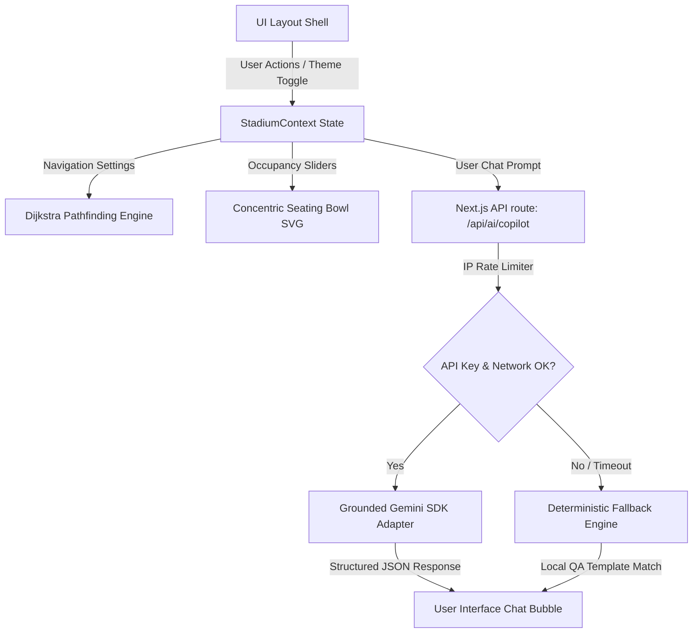

# 🏟️ StadiumFlow AI — FIFA World Cup 2026 Smart Stadium Operations & Navigation

[](https://nextjs.org/)
[](https://react.dev/)
[](https://tailwindcss.com/)
[](https://www.typescriptlang.org/)
[](https://vitest.dev/)
[](https://playwright.dev/)

StadiumFlow AI is a secure, highly accessible, and resilient GenAI-enabled command shell designed to optimize venue operations and elevate the tournament experience for fans, volunteers, on-ground staff, and emergency dispatchers at the **FIFA World Cup 2026**.

This platform combines **deterministic pathfinding and crowd telemetry** with **grounded Generative AI assistance** to coordinate crowd control, step-free emergency routing, and multilingual assistance in real time.

---

## 📸 Interface Screenshots

Explore the premium UI design and dynamic theme options (Light / Dark Mode):

| Landing Portal | Operations Console |
| :---: | :---: |
|  |  |

| Smart Routing | AI Copilot Hub |
| :---: | :---: |
|  |  |

---

## 🛠️ Key Product Features

### 1. Operations Command Center (HQ)
*   **Concentric Seating Bowl Visualizer:** Replaces abstract seating representation with a curved concentric SVG stadium bowl layout. It maps seat dots across Gate entrances, VIP suites, lower and upper stands, and public plazas.
*   **Real-time Seating Telemetry:** Renders seat dots that dynamically color-code based on simulated load metrics (Green for Vacant, Yellow/Orange/Red for occupied & congested states).
*   **Accessible Seating Indicators (`♿`):** Highlights designated step-free, wheelchair-friendly seats in public plazas, lower VIP boxes, and entry gates.
*   **Dispatcher Escalations & AI Briefs:** Integrates a real-time incident queue. Selecting an alert generates a grounded AI severity briefing and an interactive action checklist (e.g., dispatching volunteers, initiating detours).

### 2. Smart Crowd-Aware Navigation
*   **Deterministic Dijkstra Router:** Computes the fastest walking paths between Points of Interest (Gates, Stand sections, Restrooms, First-Aid stations, Transit Plazas) in `O(V log V + E)`.
*   **Accessibility Constraints:** Selecting the **Step-Free** filter dynamically bypasses stairs-only walkways, routing elderly and disabled fans exclusively through ramps, elevators, and step-free plazas.
*   **Congestion Avoidance Detours:** Automatically recalculates paths to divert fans away from active bottlenecks, applying a mathematical penalty multiplier to congested edges.

### 3. Volunteer & Fan Copilot Hub
*   **Multilingual GenAI Chat:** Supports full conversations in **English**, **Español**, and **Hinglish (Roman Hindi)**.
*   **Grounded RAG Queries:** Prompts are injected with structured live system data (active POI states, closed zones, unresolved incidents) to guarantee zero hallucinations.
*   **Resilient Offline Fallback:** If the Gemini API key is missing or calls time out, the system degrades to a local, rules-based dictionary matcher, keeping the UI fully interactive.

---

## 🏗️ Architecture & Data Flow



---

## 📂 Project Directory Structure

The codebase is organized into modular folders separating presentation, state context, static data assets, and domain logic:

```bash
FIFA CHALLENGE/
├── e2e/                     # Playwright automated End-to-End browser tests
├── public/                  # Static assets (images, icons, theme logos)
│   └── screenshots/         # UI layout walkthrough screenshots
├── src/
│   ├── app/                 # Next.js App Router pages and API routes
│   │   ├── api/             # REST/JSON endpoints
│   │   │   └── ai/          # Gemini RAG Copilot & explanation routes
│   │   ├── assistant/       # AI Copilot chatbot interface
│   │   ├── navigate/        # Smart Navigation & pathfinding map interface
│   │   ├── operations/      # Operations Command Center Dashboard
│   │   ├── layout.tsx       # Root layout configuration
│   │   └── page.tsx         # Main Landing Portal page
│   ├── components/          # Reusable React components
│   │   ├── layout/          # Page layouts (Navbar, Shell)
│   │   └── ui/              # Accessible, reusable UI components (Alerts, Buttons, Tables)
│   ├── context/             # Global Context for Stadium telemetry, pathfinding, and incidents
│   ├── data/                # Static Stadium graph node/edge descriptions
│   ├── lib/
│   │   ├── ai/              # Google Generative AI / Gemini SDK clients
│   │   ├── domain/          # Core business/operational engines
│   │   │   ├── crowd/       # Seating bowl & occupancy calculator
│   │   │   ├── decisions/   # Rules-based Q&A fallback engine
│   │   │   └── routing/     # Dijkstra graph pathfinding algorithm
│   │   └── server/          # Server utilities (IP-based API rate limiter)
│   └── types/               # Type definitions for seating, routing, and alerts
├── tests/                   # Vitest unit tests for components, state, and domain engines
└── package.json             # Build commands and dependency catalog
```

---

## ⚙️ Mathematical & Logical Specifications

### 1. Dijkstra Pathfinding Router
The core routing algorithm calculates the shortest path on a weighted graph $G(V, E)$. The edge weights $W(e)$ represent base walking distances, which are dynamically adjusted based on crowd density and accessibility filters:

$$W_{final}(e) = W_{base}(e) \times (1 + \text{Congestion Penalty}) \times \text{Accessibility Multiplier}$$

*   **Congestion Penalty:** If an edge's state is marked as `congested` or `critical`, its weight is scaled up:
    $$\text{Congestion Penalty} = \text{Congestion Ratio} \times \text{Multiplier (default: 3x)}$$
*   **Accessibility Filter:** If the **Step-Free** navigation option is selected and the edge type is `stairs`, the Edge is filtered out or its weight is set to infinity ($\infty$).

### 2. Multi-Lingual Grounding & Fallback Engine
When the user chats with the AI Copilot:
1.  **Context Injection (RAG):** The system queries the active `StadiumContext` for live state metrics (e.g. gates closed, incident count, current congestions) and injects this data directly into the system prompt.
2.  **Safety Rate Limiter:** The Next.js API route limits request frequency based on client IP using a sliding-window token bucket in `src/lib/server/rate-limit.ts`.
3.  **Deterministic Fallback:** If the Gemini API is offline, the client invokes `src/lib/domain/decisions/engine.ts` which uses optimized regular expression pattern-matchers to reply with structured, local, and accurate data.

---

## 💻 CLI Commands & Development

### 1. Installation
Install project dependencies:
```bash
npm install
```

### 2. Run Local Development Server
Launch the next.js development server:
```bash
npm run dev
```
Open [http://localhost:3000](http://localhost:3000) to view the application in the browser.

### 3. Run Quality Verification Pipeline
Executes eslint linter, TypeScript check, unit tests, and production build:
```bash
npm run verify
```

### 4. Run Unit Tests & Coverage
Runs the suite of Vitest unit tests:
```bash
# Run tests once
npm run test

# Run tests with HTML coverage report
npm run test:coverage
```

### 5. Run Automated E2E Tests
Runs Playwright end-to-end integration tests:
```bash
# Installs browsers if running for the first time
npx playwright install

# Run E2E tests
npm run test:e2e
```

---

## ♿ Accessibility Compliance (a11y)
StadiumFlow AI is built with accessibility in mind, conforming to WCAG 2.1 AA standards:
*   **ARIA Roles & Landmarks:** All pages use semantic HTML (`<main>`, `<nav>`, `<header>`, `<footer>`) with explicit descriptive labels.
*   **Keyboard Navigation:** Accessible pages support full keyboard navigation (`Tab`, `Shift+Tab`, `Enter`).
*   **a11y Testing:** We use `vitest-axe` to run automated accessibility checks inside component unit tests, verifying color contrast, image descriptions, and element nesting.
